# Neurovisual Controller Celeste

## About this repository

This project consisted of exploring the application of a neurovisual controller
to the Celeste digital game environment.

During development, game frames were captured, shrunk and later blurred.
Then, they were arranged in the K-Means clustering procedure for color quantization.
In addition, Background Subtraction algorithms of type KNN, MOG2, CNT, GMG, GSOC, LSBP and MOG have been set up to help with the
character tracking, but the game's camera shake in the scenarios of the Prologue chapter impeded the process. The tracking issue has been solved with the object tracking algorithm from the OpenCV CSRT module,
and it showed promise in both the first and second scenarios of the Prologue.

Unfortunately this study was not able to go into the stages of applying Artificial Intelligence in the game,
due to the effort of the project having been completely focused on the Digital Image Processing of the game frames.

For more information and future work, see the articles (UNPUBLISHED):
- SBC (10 pages): [article-sbc](https://drive.google.com/drive/folders/1awqB0IBz3mfYknwrCFT8yFit0jUfhpxj?usp=sharing)
- Complete (70 pages): [complete-article](https://drive.google.com/drive/folders/1urq45fw0PCxb68fonK6-go7NiwpDUJeM?usp=sharing)

The set of images referring to the game's frames, and the videos of this study can be viewed at: [images-and-videos](https://drive.google.com/drive/folders/12Togk7tzJd-ubR5bDLuNFji2HcSBhUEI?usp=sharing)

## Examples

### Capture, shrinking and blur
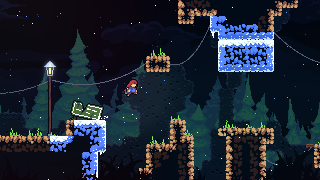
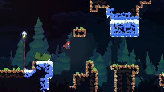

### *K-Means clustering* for color quantization
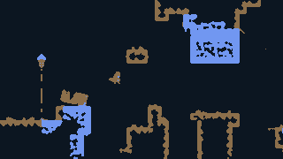  
With *K* = 3.

### Character tracking with CSRT in the first scenario of the Prologue chapter
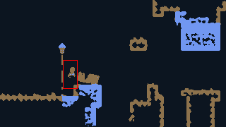
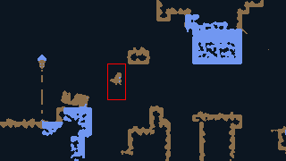  
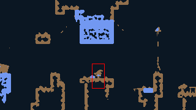
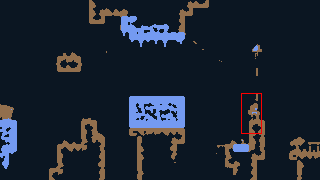

### Character tracking with CSRT in the second scenario of the Prologue chapter
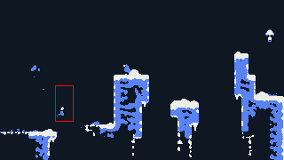
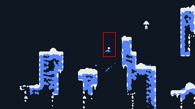  
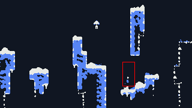
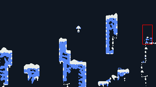

## Packages

```shell
pip install opencv-python
pip install tensorflow
pip install opencv-contrib-python
```

### Optional packages

To get the target application window name
```shell
pip install PyGetWindow
```

To realize Image Registration tests
```shell
pip install scikit-image
```
